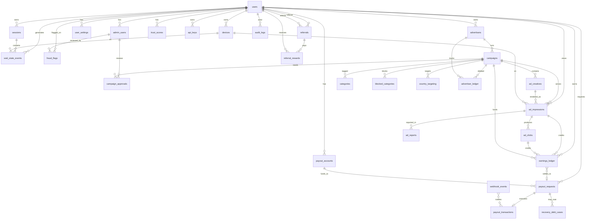

# Entity-Relationship Diagram

Mermaid ER diagram of the core WaitLayer schema. Mirrors `docs/03-database-schema.md`
(prose column definitions) — this is the visual complement.

## Notes

- Money columns use integer **minor units** + a currency code; ledger tables are
  append-only.
- All mutable business records carry `created_at` / `updated_at`; admin-sensitive
  tables carry `audit_logs` coverage.
- `sessions.device_id` and `wait_state_events.device_id` link activity to a
  registered device for fraud/rate-limit tracking.
- `payout_requests.payout_transaction_id` is nullable until a `payout_transactions`
  row is created (async PSP processing).
